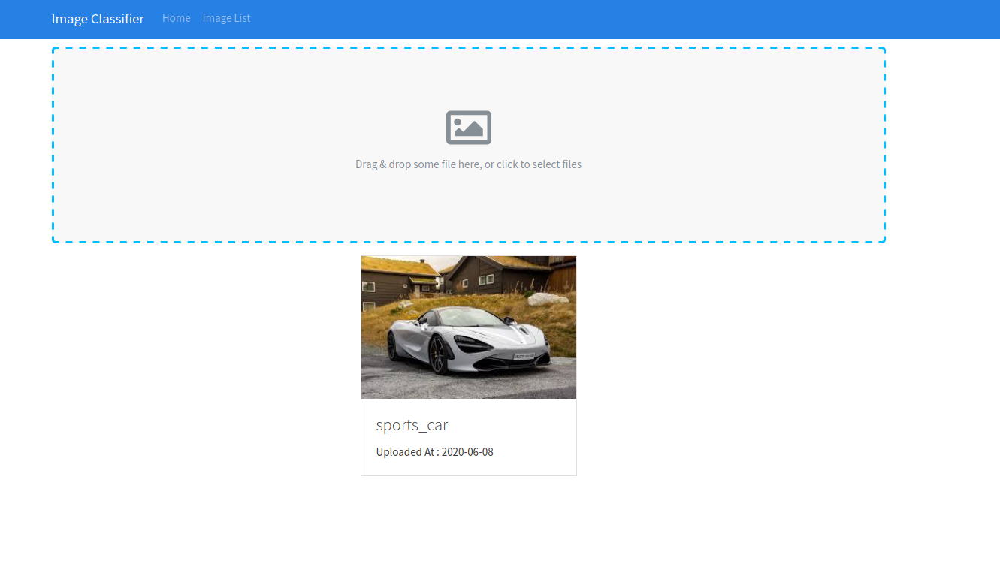

>#### Image Classification Web App Using Django,React,Keras,InceptionResNetV2
#

#

#### Quick Start
    # Install front-end dependencies
    npm install

    # Install backend-end dependencies and active virtual env
    pip install -r requirements.txt

    # Database Migration (from root)
    python manage.py migrate

    # Super user Create
    python manage.py createsuperuser

    # Serve API on localhost:8000 (from root)
    python manage.py runserver

    # Run webpack (from root)
    npm run dev

    # Build for production
    npm run build
